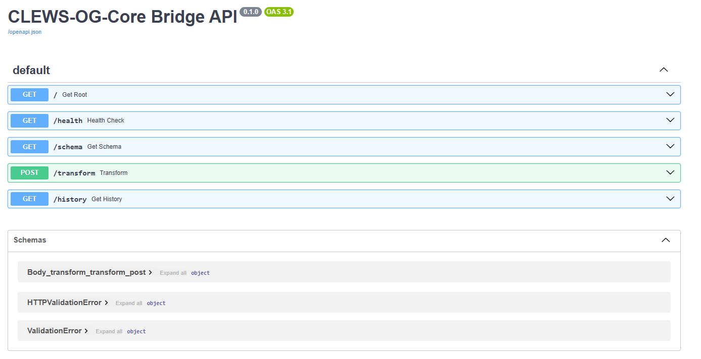
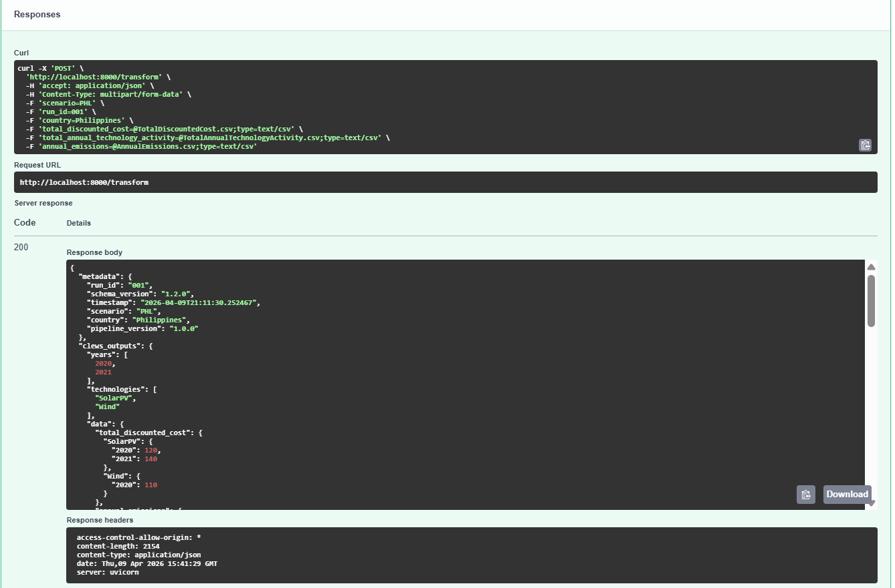
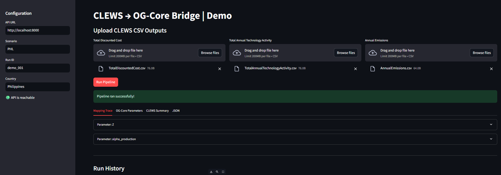
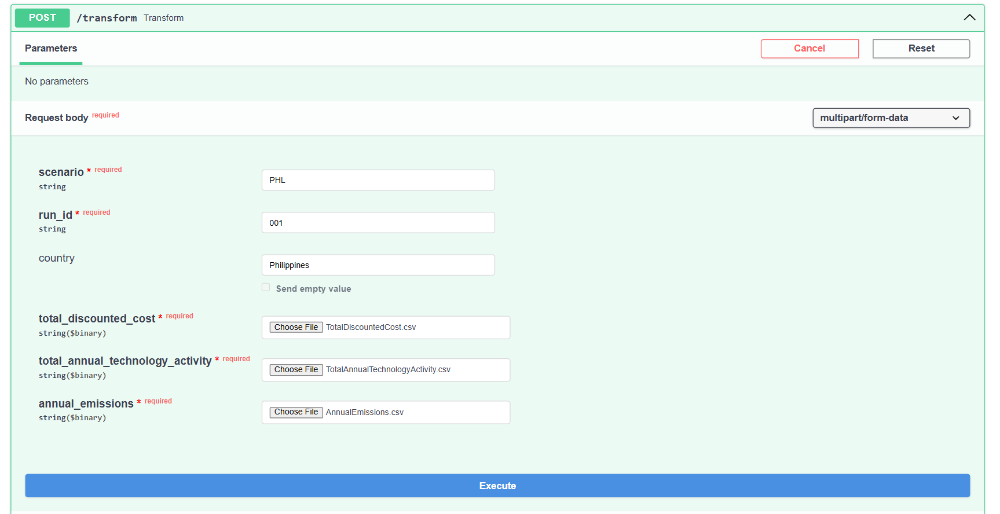
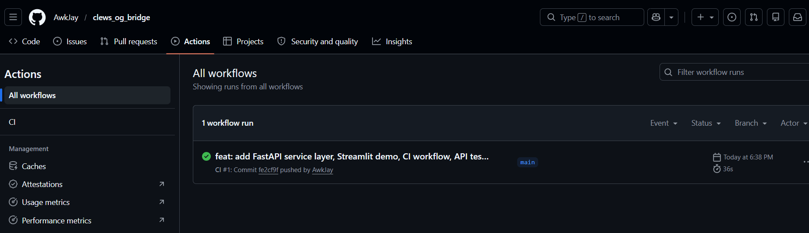

# CLEWS → OG-Core Semantic Integration Bridge

[](https://github.com/AwkJay/clews_og_bridge/actions)


A validated semantic transformation pipeline that maps CLEWS physical system outputs
(OSeMOSYS/GLPK) into economically meaningful OG-Core macroeconomic parameters — with
full mapping trace, strict schema validation, and a FastAPI service layer.

---

## The Problem

CLEWS and OG-Core operate on fundamentally different abstractions:

- **CLEWS** models physical resource systems: energy flows (PJ), capacity (GW),
  technology activity, emissions — solved via OSeMOSYS/GLPK linear programming.
- **OG-Core** models macroeconomic equilibrium: Total Factor Productivity (Z),
  sectoral production weights (α), household consumption shares.

Connecting these models is not a format conversion problem. It is a
**semantic translation problem**: a number in PJ from CLEWS does not map directly
to a dimensionless TFP scalar in OG-Core without an explicit economic interpretation.

Passing CLEWS outputs naively into OG-Core produces incorrect TFP estimates,
unstable equilibrium solutions, and misleading policy conclusions — errors that
are silent unless explicitly checked.

---

## What This Project Does

This repository implements a five-stage pipeline:

```
CLEWS CSVs (OSeMOSYS output)
    ↓
Reader      — parse TotalDiscountedCost, TotalAnnualTechnologyActivity, AnnualEmissions
    ↓
Normalizer  — unit enforcement, year/technology index alignment
    ↓
Mapper      — apply economic transformations (elasticity-based, sector-weighted)
    ↓
Validator   — Pydantic v2 strict mode + numeric bounds (Z > 0, Σα = 1)
    ↓
ExchangeModel JSON  — OG-Core-compatible parameters with full mapping trace
```

Every transformation is explicit and auditable. No assumption is embedded silently
in the code — all mapping rules live in `configs/mapping.yaml`.

---

## Architecture

### Key Components

| File | Role |
|---|---|
| [`src/clews_og_bridge/pipeline.py`](src/clews_og_bridge/pipeline.py) | Orchestrates the five-stage pipeline |
| [`src/clews_og_bridge/mapper.py`](src/clews_og_bridge/mapper.py) | Dispatches CLEWS variables to registered transformers |
| [`src/clews_og_bridge/transformers/`](src/clews_og_bridge/transformers/) | Economic transformation logic (TFP, production weights) |
| [`src/clews_og_bridge/config.py`](src/clews_og_bridge/config.py) | `MappingConfig` Pydantic v2 model, loaded from YAML |
| [`src/clews_og_bridge/models.py`](src/clews_og_bridge/models.py) | `ExchangeModel`, `MappingTraceEntry` schema definitions |
| [`main.py`](main.py) | FastAPI service layer — `/transform`, `/health`, `/schema`, `/history` |
| [`configs/mapping.yaml`](configs/mapping.yaml) | Country-configurable mapping rules |

### Service Layer

The pipeline is exposed as a REST API:

```
POST /transform   — accepts 3 CLEWS CSVs, returns ExchangeModel JSON
GET  /health      — liveness check
GET  /schema      — returns active mapping.yaml as JSON
GET  /history     — last 200 run records (in-memory)
GET  /            — service manifest
```



---

## Example: Z (Total Factor Productivity)

CLEWS `TotalDiscountedCost` is translated to OG-Core TFP via:

```
Z = (C_base / C_current) ^ α
```

Where `C_base` is the configured baseline cost, `C_current` is the CLEWS output
for the current period, and `α` is the elasticity parameter (default 0.3 per sector).

Lower energy costs → higher effective productivity, under the elasticity assumption.
This relationship is explicit in the mapping trace for every run.

### Actual pipeline output (from `examples/example_output.json`)

```json
{
  "og_parameters": {
    "parameters": {
      "Z": {
        "value": {
          "utilities": {
            "2020": 0.779,
            "2021": 0.904
          }
        },
        "units": "dimensionless",
        "og_core_meaning": "Total Factor Productivity (TFP) level by industry and year."
      }
    },
    "mapping_trace": {
      "Z": {
        "source_variable": "total_discounted_cost",
        "target_parameter": "Z",
        "transformation_type": "productivity_relative_to_cost",
        "formula": "Z = (Cost_base / Cost_current)^alpha",
        "aggregation_rule": "sum",
        "elasticity_used": 0.3,
        "input_unit": "Million USD",
        "injection_location": "update_specifications -> production function"
      }
    }
  }
}
```



---

## Validation Strategy

Validation runs at three levels before any output is written:

- **Structural** — Pydantic v2 strict mode, schema shape enforcement
- **Numeric** — bounds checking (`Z > 0`, production weights sum to 1.0)
- **Economic** — sector coverage consistency, baseline reference integrity

Invalid data raises before reaching the writer. Atomic file writes
(`tempfile` + `os.replace`) ensure no partial output is ever written to disk.

---

## Local Setup

```bash
# Install
pip install -e .

# Start API
uvicorn main:app --reload --port 8000

# Visit http://localhost:8000/docs for interactive API documentation

# Start demo UI (separate terminal)
streamlit run streamlit_app.py
```

### Streamlit Demo



The demo client calls the FastAPI backend via `httpx` and surfaces the
mapping trace, OG-Core parameter values, and CLEWS outputs in tabbed views.
It is a local exploration tool — not a hosted service.

---

## API Contract

**POST /transform**

| Parameter | Type | Required | Description |
|---|---|---|---|
| `total_discounted_cost` | CSV file | ✅ | `TotalDiscountedCost.csv` from CLEWS |
| `total_annual_technology_activity` | CSV file | ✅ | `TotalAnnualTechnologyActivity.csv` |
| `annual_emissions` | CSV file | ✅ | `AnnualEmissions.csv` |
| `scenario` | string | ✅ | Scenario label (e.g. `mauritius_baseline`) |
| `run_id` | string | ✅ | Unique run identifier |
| `country` | string | — | Optional country label |

**Response:** `ExchangeModel` — `metadata`, `clews_outputs`, `og_parameters` (with `mapping_trace`)



**PowerShell:**
```powershell
curl.exe -X POST http://localhost:8000/transform `
  -F "total_discounted_cost=@tests/data/TotalDiscountedCost.csv" `
  -F "total_annual_technology_activity=@tests/data/TotalAnnualTechnologyActivity.csv" `
  -F "annual_emissions=@tests/data/AnnualEmissions.csv" `
  -F "scenario=mauritius_baseline" `
  -F "run_id=test_001" `
  -F "country=Mauritius"
```

**bash/macOS/Linux:**
```bash
curl -X POST http://localhost:8000/transform \
  -F "total_discounted_cost=@tests/data/TotalDiscountedCost.csv" \
  -F "total_annual_technology_activity=@tests/data/TotalAnnualTechnologyActivity.csv" \
  -F "annual_emissions=@tests/data/AnnualEmissions.csv" \
  -F "scenario=mauritius_baseline" \
  -F "run_id=test_001" \
  -F "country=Mauritius"
```

---

## CLI Usage

```bash
python -m clews_og_bridge.cli run \
  --input-dir tests/data \
  --mapping-file configs/mapping.yaml \
  --output-file examples/example_output.json \
  --scenario "mauritius_baseline" \
  --run-id "001"
```

---

## Testing

```bash
pytest tests/ -v
```

```
tests/test_api.py::test_health                              PASSED
tests/test_api.py::test_schema                             PASSED
tests/test_api.py::test_transform_success                  PASSED
tests/test_api.py::test_transform_missing_file_returns_422 PASSED
tests/test_api.py::test_history                            PASSED
tests/test_mapper.py::test_mapping_logic                   PASSED
tests/test_og_core_compat.py::test_og_core_payload_compatibility PASSED
tests/test_pipeline.py::test_full_pipeline_execution       PASSED
tests/test_reader.py::test_read_valid_csvs                 PASSED
tests/test_transformers.py::test_productivity_transformer  PASSED
tests/test_transformers.py::test_production_weights_transformer PASSED
tests/test_validator.py::test_validator_accepts_valid_instance PASSED
tests/test_validator.py::test_validator_strict_non_numeric_value PASSED

13 passed in 2.46s
```



---

## Extending the System

New country models or additional CLEWS variables require no changes to core logic:

1. Add mapping rules to `configs/mapping.yaml`
2. Implement a transformer in `src/clews_og_bridge/transformers/`
3. Register it in `mapper.py`

This isolates economic interpretation from pipeline mechanics and allows
per-country configurations without regression risk on existing mappings.

---

## Current Limitations

- Reverse ETL (OG-Core → CLEWS feedback) not yet implemented
- Three CLEWS variables currently supported (`TotalDiscountedCost`,
  `TotalAnnualTechnologyActivity`, `AnnualEmissions`)
- Per-country calibration requires a configured `mapping.yaml`;
  no public OG-Core calibration exists for SIDS countries yet

---

## Future Work

- Bidirectional coupling with convergence loop (SOR dampening)
- Scenario comparison and diff tooling
- Integration with MUIOGO runtime environment
- Country-specific calibration support for SIDS deployments